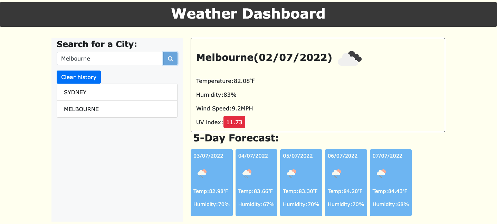

# Weather-Dashboard

A weather dashboard application that helps us find the weather at any given location.
By Raj Nori. Weather dashboard app

## Table of Contents

- [General Info](#general-information)
- [Technologies Used](#technologies-used)
- [Features](#features)
- [Screenshots](#screenshots)
- [Video](#Video-walkthrough)
- [Setup](#setup)
- [Usage](#usage)
- [Project Status](#project-status)
- [Room for Improvement](#room-for-improvement)
- [Acknowledgements](#acknowledgements)
- [Contact](#contact)

## General Information

# Project Name

> Weather Dashboard using Server Side API
> 

## Description

A simple Weather forecast app to help travellers check the weather.

## License

This application is covered under the MIT License.

## User Story

AS A traveler
I WANT to see the weather outlook for multiple cities
SO THAT I can plan a trip accordingly

## Acceptance Criteria

GIVEN a weather dashboard with form inputs
WHEN I search for a city
THEN I am presented with current and future conditions for that city and that city is added to the search history
WHEN I view current weather conditions for that city
THEN I am presented with the city name, the date, an icon representation of weather conditions, the temperature, the humidity, the wind speed, and the UV index
WHEN I view the UV index
THEN I am presented with a color that indicates whether the conditions are favorable, moderate, or severe
WHEN I view future weather conditions for that city
THEN I am presented with a 5-day forecast that displays the date, an icon representation of weather conditions, the temperature, the wind speed, and the humidity
WHEN I click on a city in the search history
THEN I am again presented with current and future conditions for that city

## Technologies Used

- JavaScript - ES6
- Jquery
- Css - version 3.0
- Html - version 5

## Features

Takes the City and returns the weather forecast for the given city including the UV index amongst other features. It also gices us the forecast for the next 5 days so if you are a business traveller it should help check the forecast before making business decisions.

## Screenshots

## Video

Please clink on the link below for the walkthrough video...

## Setup
Please enter this URL in your browser (https://rajnori.github.io/WeatherAPI/) . 

Enter the city and get the weather forecast

## Usage

Traveller's weather application

## Project Status

Project is: \_complete

## Room for Improvement

Room for improvement:

- Mobile friendly, responsive and added features.

To do:

-

## Acknowledgements

Give credit here.

- This project was inspired by...Monash Bootcamp
- This project was based on the assignment Weather Dashboard.

## Contact

Created by [@rajnori](https://rajnori.github.io/Portfolio-project/) - feel free to contact me!

